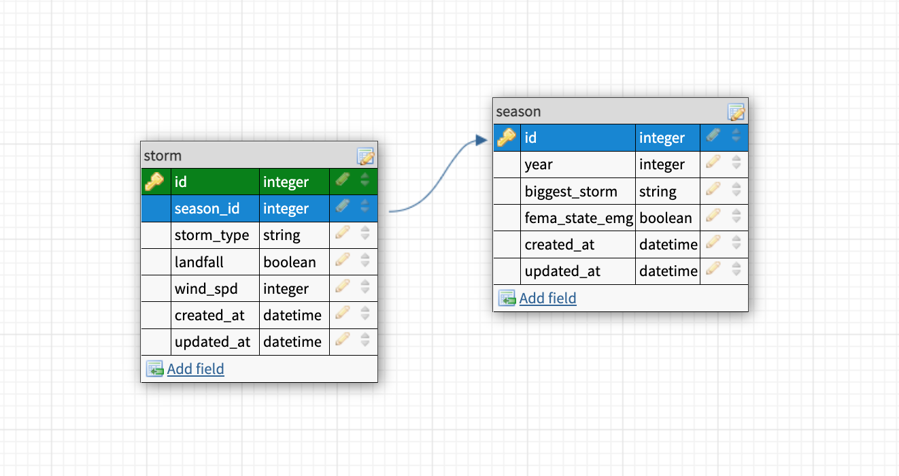

<!-- PROJECT LOGO -->
 

  

<h1 align="center">Relational Rails</h1>

## About The Project

This was the initial rails project given to me while at the Turing School of Software Design. The project goal was to build a simple database. <!-- I have kept this project as a measuring stick for my journey in learning Rails / Software Engineering. -->

### Built With

* Ruby

<!-- GETTING STARTED
## Getting Started -->

<!-- ROADMAP -->
## Roadmap

* [ ] Iteration ONE
    * [x] User Story 1
    * [x] User Story 2
    * [ ] User Story 3
    * [ ] User Story 4
    * [ ] User Story 5
    * [ ] User Story 6
    * [ ] User Story 7
    * [ ] User Story 8
    * [ ] User Story 9
    * [ ] User Story 10
* [ ] Iteration TWO
    * [ ] User Story 11
    * [ ] User Story 12
    * [ ] User Story 13
    * [ ] User Story 14
    * [ ] User Story 15
    * [ ] User Story 16
    * [ ] User Story 17
    * [ ] User Story 18
* [ ] Iteration THREE
    * [ ] User Story 19
    * [ ] User Story 20
    * [ ] User Story 21
    * [ ] User Story 22
    * [ ] User Story 23
* [ ] Extensions
    * [ ] User Story 1
    * [ ] User Story 2
    * [ ] User Story 3

<!-- CONTACT -->
## Contact

Joseph Hilby: [https://github.com/josephhilby](https://github.com/josephhilby)

Project Link: [https://backend.turing.edu/module2/projects/relational_rails/](https://backend.turing.edu/module2/projects/relational_rails/)

<!-- ACKNOWLEDGMENTS -->
## Acknowledgments

* Turing School of Software Design: [https://turing.edu/](https://turing.edu/)